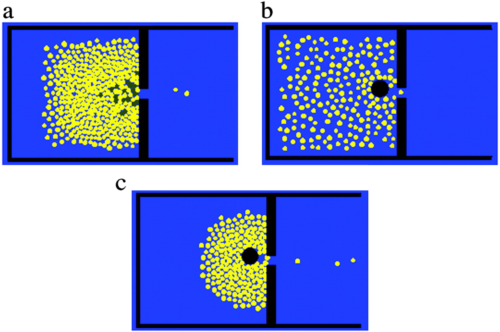

# Insights:

[TRANSIMS download](FlowManagement.docx)

## Source Paper:
[link](https://www.pnas.org/content/99/suppl_3/7280)
### TRANSIMS Text:

Flows and Flow Management

Agent-based modeling can be used to simulate the flow of agents based on real life data on the nature of an agent’s movement. This is done through the TRANSIMS package, which provides you with easily constructed simulated populations (of individuals or vehicles) including activity patterns such as travel on roadways or on foot. Additionally TRANSIMS allows for tracking of vehicular emissions and simulation of entire regional transport networks.  \

“Travel information is derived from actual census and survey data for specific tracts in target cities, providing a more accurate sense of the movements and daily routines of real people as they negotiate a full day with various transportation options available to them. TRANSIMS is based on (and contributes to the further development of) advanced computer simulation codes developed by Lawrence Livermore National Laboratory for military applications.”  \

While TRANSIMS was developed with military use in mind, it presents endless possibilities for ABM in the future of almost any aspect of life. One popular example of uses for this package is traffic flow management. While the concept of flow management has many possibilities, perhaps the most intuitive is traffic flow management. Traffic on city streets has much room for improvement, and repairs/infrastructure changes are expensive. By using TRANSIMS, one could map the current roadway system in each region and find choke points or points of traffic that need changing, which could be destruction of superfluous roads or additions of side roads. You could use the same technology to assess the effectiveness/efficiency of a bridge or traffic signal.  \

A second possible use for TRANSIMS is for the flow of foot traffic in an event space. Those who organize huge social gatherings (not currently of course), could utilize TRANSIMS to simulate possible evacuation situations like fire, flooding, or an active shooter. Using TRANSIMS, you could optimize the layout of the venue to plan for an emergency and ensure the maximum number of people are able to escape, if need be. This kind of use can translate to any scale, from maximizing the safety of your one bedroom apartment to optimizing the macro level layout of a Disney park to ensure guests can see as much of the park as possible in a finite amount of time.

