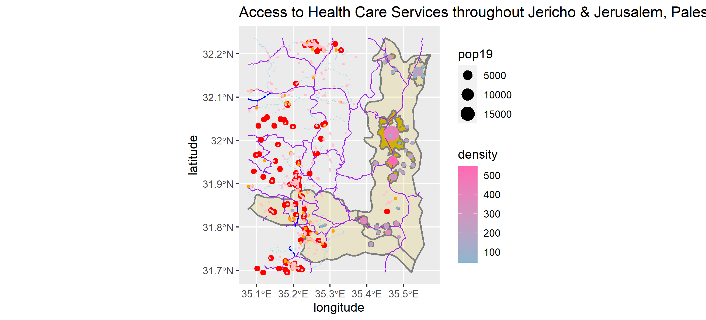

# Project 1:

## Part 1a: Geometric Bar Plot 

## Part 1b: Plot of the de facto settlement boundaries with geometric measures of population and density for all locations.

### Also, include a description and analysis of the system of settlements that populate your selected location:

### Part 1c

Provide an analysis of the system of settlements sizes and relative location to one another.
Provide an analysis of the transportation network and its capacity to facilitate access across your selected area.
