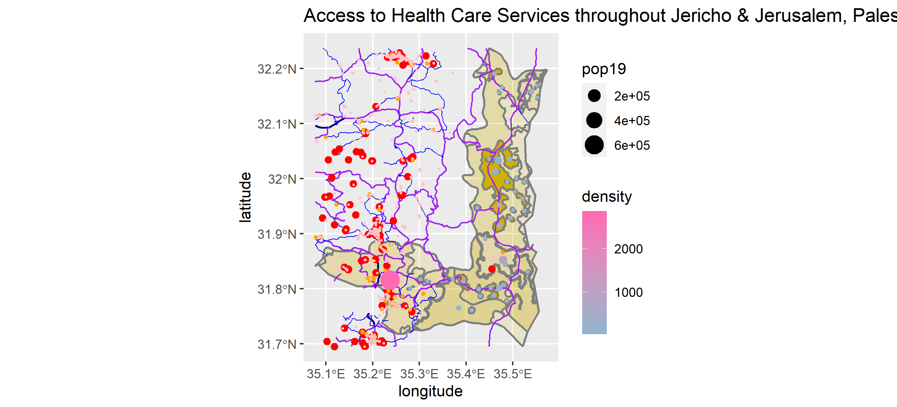

# Project 1:

## Part 1a: Geometric Bar Plot 

## Part 1b: Plot of the de facto settlement boundaries with geometric measures of population and density for all locations.

### Also, include a description and analysis of the system of settlements that populate your selected location:

The densest settlements are mostly around central Jericho, there are also main roads leading to each of the three largest settlements in that area.  There is also a lack of hospitals and HCF's in Jericho, while Jerusalem is far more 'developed' in this sense. In retrospect, there seem to be a few missing settlements, as there is a higher population density in central Jerusalem than anywhere else in the selected area. A possible explanation is that the size and somewhat even concentration across that area of Jerusalem may have caused the code to not correctly identify the settlements in that region. I was hoping that the sparseness of Jericho and density of populations in Jerusalem would provide an interesting sample, although it would seem something went wrong, as the plot identifies multiple large settlements in Jericho and no similarly large ones in Jerusalem.

## Part 1c

### Provide an analysis of the system of settlements sizes and relative location to one another:
Settlements are largely close together in these regions of Palestine. There is vast space of sparsely populated areas for the majority of space, with a handful of larger settlements in the central area of both Jericho and Jerusalem. As mentioned above, it is likely that larger settlements in Jerusalem are not included in the plot, probably due ot a coding error. In Jericho, settlements are clearly organized in a North to South fashion, a structure that is strengthened by the main road that runs from North to South as well.

### Provide an analysis of the transportation network and its capacity to facilitate access across your selected area:

It should be noted that given the level of roadway mapped, Jericho lacks roadways other than the main one going through the center. A possible explanation for this is that there is a large network of smaller roads that is not captured in the plot.
