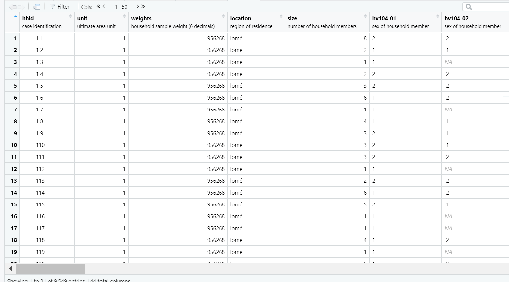
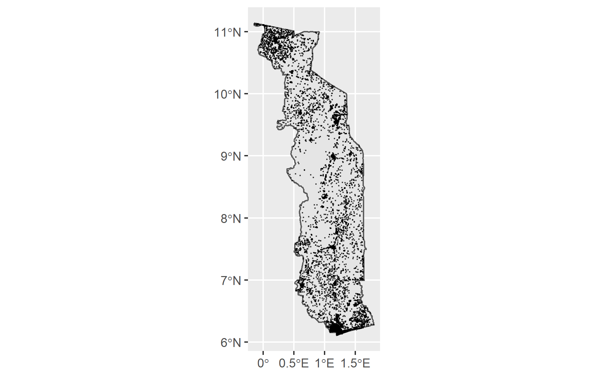
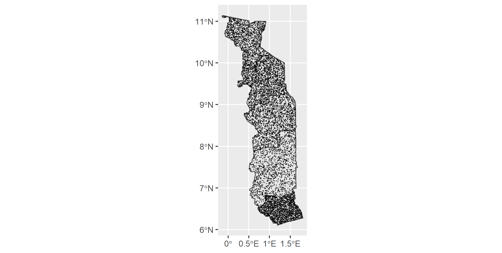
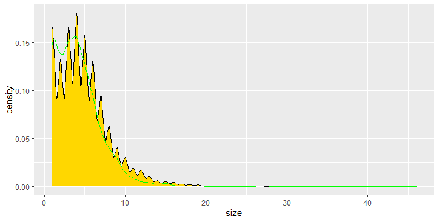

# IN PROGRESS
## 1. Provide a written description of your selected household survey including the number of household and person observations as well as the variables in your source data.
   After requesting household survey data for Palestine (my original country of choice), I found that there was not sufficient data from other sources to continue the analysis. Unfortunately, I also had a similar experience afterwards and ended up trying and failing to find sufficient GPS (or other) data for Ghana, Zambia, and Egypt (size problem), I landed on Togo. This was a significant setback in my progress. I utilized the most recent DHS household survey, which was from 2013-14. The survey consists of 9549 households across Togo. The collected information used in this analysis are as follows: hhid (household id), hv004 area unit, hv005 (weights), size(hv009), shregion (region of residence), hv009 (household size), hv104_01-46 (sex of hh members), hv105_01-46 (age of hh members), hv106_01-46 (education level of hh members), and hv270 (wealth of hh). The average size of household in Togo is 4.6 persons.

## 2.	Provide a written description of your spatially located households at the adm0 level of your selected location, including how you located each household, generated the household structure including demographic attributes of persons, and the percent error calculated. If you faced computational issues at the adm0 level when attempting to pivot from households to persons, describe those limitations.

   The sum of hhs weights is similar to the number of rows in the survey data, although there was a slightly odd occurrence. The sum of weights adds up to the same combination of numbers as the nrows, but is multiplied by a factor of 6, such that the division of sum(hhs$weights)/nrow(hhs) = 1e+06. \ 
The first approach to mapping households at the adm0 level was to appoint observations from the household data to random points, tailored to the population density raster from worldpop. This approach resulted in the following map, where each dot is a household/observation. \

\
   To generate the household structure in a way that contained appropriate demographic information, I had to pivot the data from the DHS. The first step was to create separate dataframes for sex, age, education, wealth, household size, survey weight, and household location. Then, using cbind(), I was able to create a master dataframe containing all the demographic and location information for the dataset. Then it is time to create the pivot objects [from the master dataframe] for sex, age, and education. I struggled with indexing these commands correctly. Using negative indexing resulted in unexpected dimensions of the data, which genuinely confused me, I workshopped this issue for an extensive period of time. My solution was to create a custom list of all of the column numbers I needed to capture [with c()] and went from there, this was successful.
\
   Percent error calculated was 999862.3, using: “abs((nrow(tgo_hhs_locs) - sum(tgo_hhs_locs$weights)) / nrow(tgo_hhs_locs))” This led me to believe that an error occurred, although I was unable to determine the nature of this. 

## 3.	Provide a written description of your spatially located households at the adm1 or adm2 level of your selected location, again including how you located each household, generated the household structure including demographic attributes of persons, and the percent error calculated. Further analyze your synthetically generated households and persons with regard to percent error. Do you think this population is more or less accurate than the one generated at the adm0 level? What could you have done to improve your measures of accuracy?

   Using the same pivoted data as before, I was able to retain all demographic information that we needed. I decided to use adm1 level data to place my households. I used a sample from Maritime, the most metropolitan of regions at the adm1 level. \
   Using a sample of locations from the adm1 level simple features object, controlled using the hhs dataset and its locations values. I achieved this by running the following line: “tgo1_dhslocs <- st_sample(tgo_adm1_sf, table(hhs$location))” and then plotting that object over the sf. This resulted in the following map, which seems slightly more realistic than the previous version which used rpoint. \

   These household observations retained the demographic information that was assigned earlier. This allows you to analyze differences in these areas across regions. This analysis is probably more accurate than if you conducted it on the previous households using rpoint. I can assume this because the distribution of population across regions is more accurate in terms of population density. \

   Percent error calculated was: 0.005292524. I found this with the following code: “nrow(pns) / cellStats(tgo_raster_pop19, 'sum') # person sample proportion” \
   
   It is hard for me to say in terms of percent error calculated whether or not this is a more accurate design. This is because of the issues I ran into when calculating error in the adm0 level design. Although intuitively this seems more accurate. There are many improvements that could be made here. Firstly, I am overall unsure of the precision of the error terms in both the adm0 and adm1 level designs. It is clear at this stage that computational difficulties hindered my ability to extract accurate information from my model. One of these improvements would be improving my code overall, as some of the parameters may be not fit the data in the correct way and be affecting the outcomes. I also could use adm2 level information to improve accuracy. \ Below is a geom Density plot description of my dataset.

   This plot is consistent with the national average for household size, which was 4.6. The plot is clustered around 0-10 and tapers off significantly after that. This makes sense intuitively and implies that the adm1 level data is at least not horribly skewed.
   
## 4. When compared to a randomly generated synthetic population that describes the demographic attributes of households and persons, does yours more closely approximate reality? How is yours an improvement over a synthetic population that was generated in accordance with complete spatial randomness? Generate plots and incorporate results from your work as evidence in support of an argument that the synthetic population you generated is a good approximation of the reality that existed in your selected location at that given time.

In creating the slice samples using the maritime adm1, I ran into another issue. My laptop was unable to allocate the memory required by the command: "b.	adm1_sampP <- slice_sample(hhs, n = maritime_hhs_n, replace = TRUE) \ 
adm1_sampP1 <- slice_sample(maritime_hhs, n = maritime_hhs_n, replace = TRUE) \
I troubleshot this issue over the course of a couple of days and was completely unsuccessful. Additionally, all online resources suggested using a different device to run the command, which I was unable to do.
I was also unable to produce heatmaps that seemed to be useful. Using the raw data I was able to produce a single heatmap, although it is not what I expected. I also believe that it does not represent variation in the data in the same way that we expect it too. Overall this was a dissapointing end to a project which gave me many problems over the course of the class. Multiple attempts to troubleshoot over slack and email did not earn replies, which was also a significant setback as I was unable to attend office hours.

