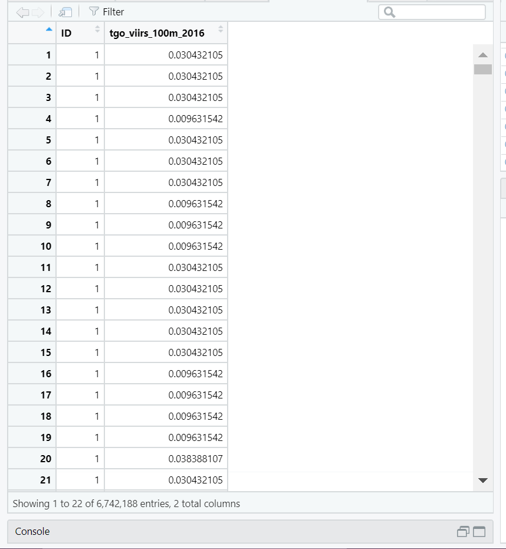
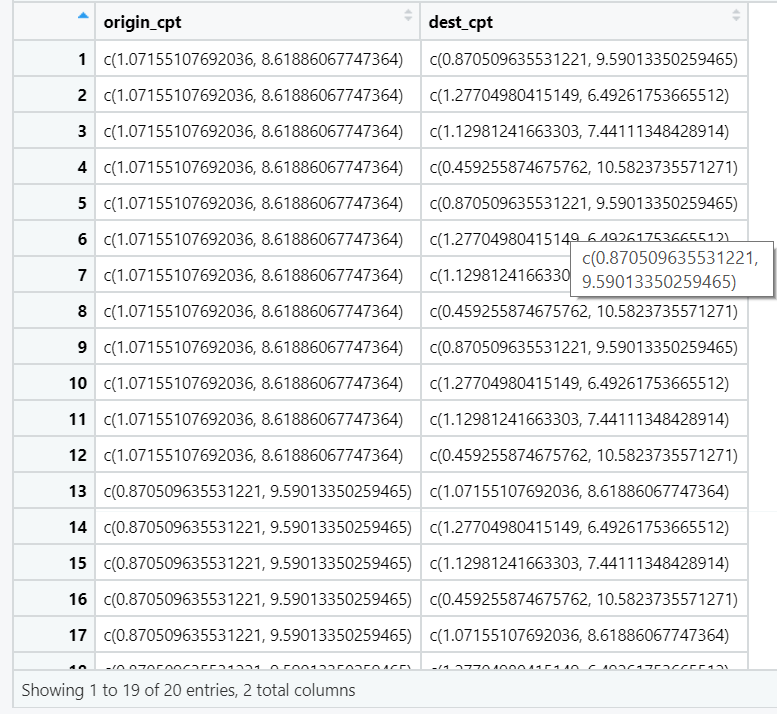
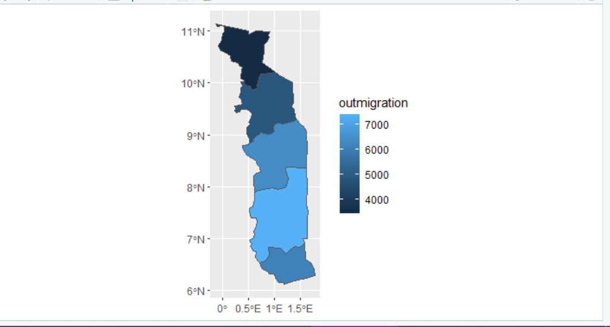
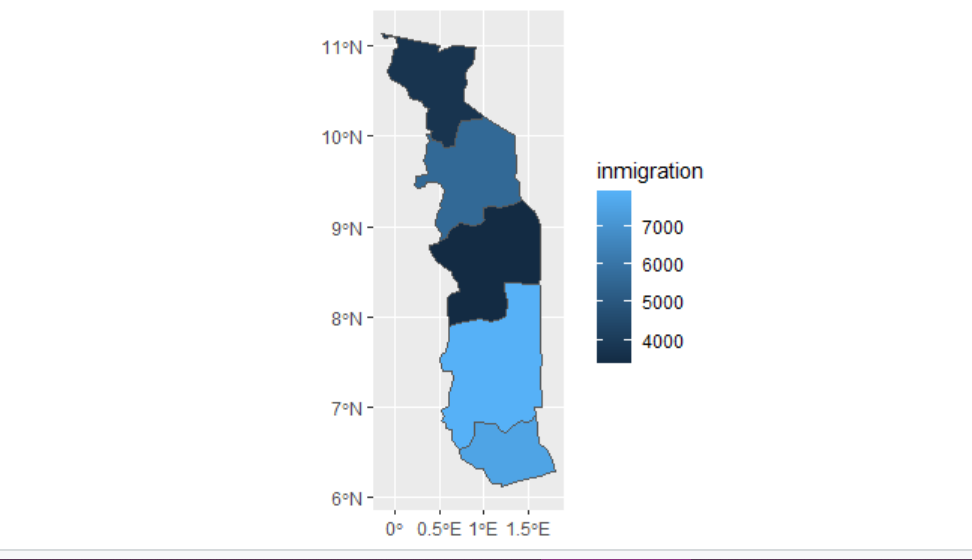
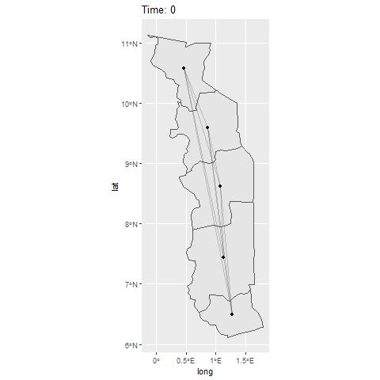

# Project 3
## Q1
Following the tutorial from Dr Ds Idiots Guide to Spatial Interaction Modelling for Dummies - Part 1: The Unconstrained (Total Constrained) Model, I was able to implement a gravity model of London. Using adm level population and income statistics, the tutorial walked me through how to implement the model. The tutorial produced this matrix of comings and goings, which takes into account aforementioned indicators to determine the probability of migration.

## Q2
Following the tutorial, I began to work on a gravity model of migration for Togo. I was lucky enough to have access to 2016 data, relatively recent compared to some other countries. I had to decide which adm level to use for this analysis. Adm 1 level data was the most practical, as I have learned through the semester that some of the adm2 level data for Togo is incomplete. Using the 5 year, 100m resolution migration flow data from WorldPop, I was able to construct the following matrix. I also include a figure that details the name of each origin and destination, as it is identified by an index, not the names of the districts. There were only 5 rows in the matrix as I conducted the analysis on the adm1 level.

The distance between each location is shown in the table below:

Migration flows between locations are shown here in the ODM:

I used the 2016 night-time lights data provided by WorldPop. These values are presented below:

A description of the center points for destinations and origins is provided below. The matrix is 20x2.

## Q3

Included below is density of emigration and immigration flow between the adm1 level boundaries:

The results shown in the figures above are a bit surprising, as the southern most region of Togo is by far the most populous, and I would expect it to have the most immigration and emigration due to the sheer difference in population among the other regions.

Using and pivoting the outmigration and inmigration statistics I was able to construct the ODM. By applying the night-time lights statistics, I mapped flow in and out of each area separated by adm1 level boundaries, resulting in the immigration and emigration flows shown in figures above.

## Q4

Shown below is the gif produced by my ODM and gravity model:

To modify the number of points departing from each origin, I would apply weighting based on the relative populations of each subdivision. I am unsure as to the professional value of making a change like this.\
I think it would be ideal for most any Data Scientist to be able to accurately simulate migration across a larger amount of time. Being able to map a more “macro” trend of migration flows may indicate previously unknown characteristics about the Togo population.\
The accuracy and precision of my own analysis is certainly not up to a professional standard. Given more time to accurately produce this research, the gravity model could potentially map highly accurate movements of the population over an extended period time.\

## Q5

This question includes one of my more major setbacks for the project. Due to the fact that I switched between countries multiple times over the course of the semester, I was unable to construct de facto settlements for Togo. As a result, the voronoi polygon portion of this proect remains unsuccessful.
