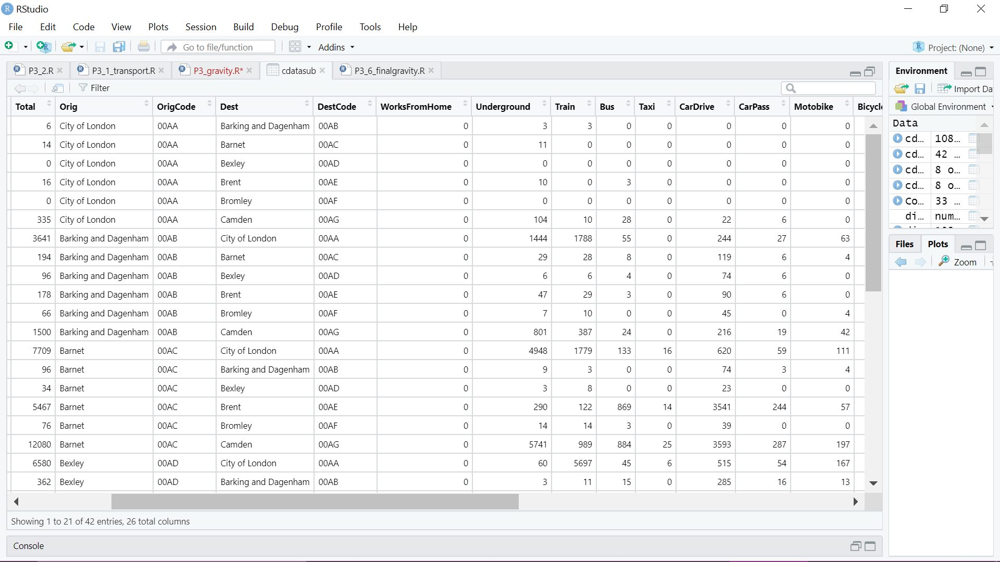
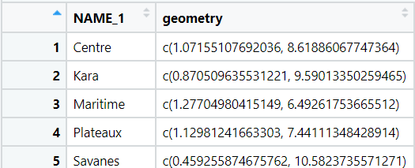
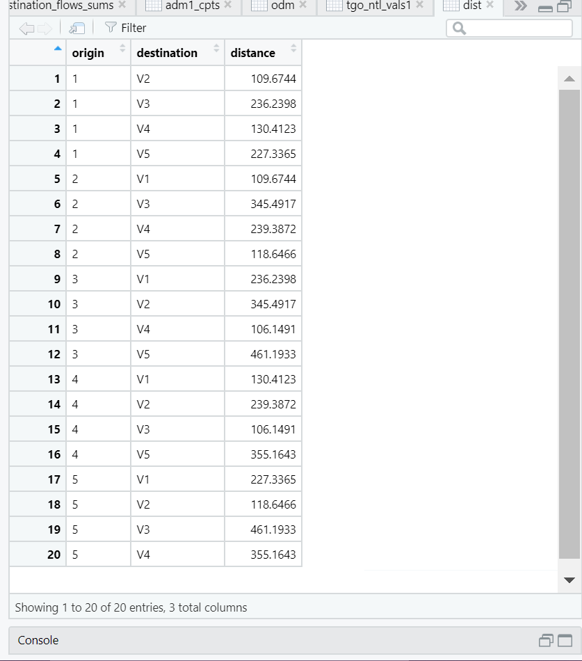
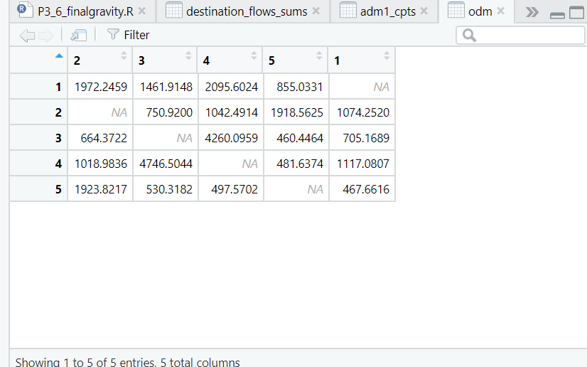

# Project 3
## Q1
Following the tutorial from Dr Ds Idiots Guide to Spatial Interaction Modelling for Dummies - Part 1: The Unconstrained (Total Constrained) Model, I was able to implement a gravity model of London. Using adm level population and income statistics, the tutorial walked me through how to implement the model. The tutorial produced this matrix of comings and goings, which takes into account aforementioned indicators to determine the probability of migration.

## Q2
Following the tutorial, I began to work on a gravity model of migration for Togo. I was lucky enough to have access to 2016 data, relatively recent compared to some other countries. I had to decide which adm level to use for this analysis. Adm 1 level data was the most practical, as I have learned through the semester that some of the adm2 level data for Togo is incomplete. Using the 5 year, 100m resolution migration flow data from WorldPop, I was able to construct the following matrix. I also include a figure that details the name of each origin and destination, as it is identified by an index, not the names of the districts. There were only 5 rows in the matrix as I conducted the analysis on the adm1 level.

The distance between each location is shown in the table below:

Migration flows between locations are shown here in the ODM:

